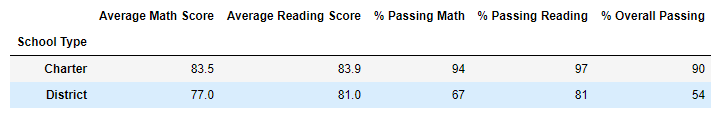
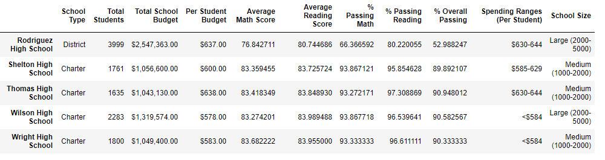
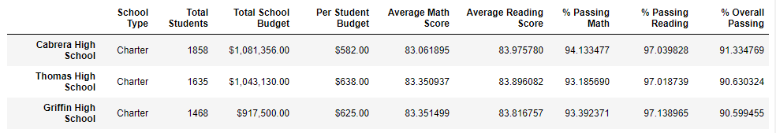
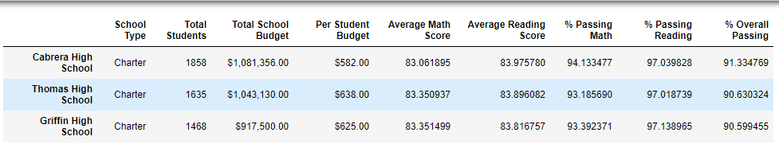

# School District Analysis
# Overview of Analysis
## Purpose
The purpose of this analysis was to alter the data to remove information from the ninth-grade class at Thomas High School due to academic dishonesty. Once that data has been removed, the next goal was to rerun the data and calculate the overall passing percentages of the students and identify if removing the data altered the overall results.
# Results
## District Summary Results 
The results between charter schools and district schools did not change, all of the scores remained the same even altering the data. 

 
## School Summary Results 
Overall, for the school summary results, there were slight changes in the average math score and the percentage overall passing, however it was a very small change. 
### Before Thomas High School Ninth-Grade Removal (Module Work)
- Average Math Score: 83.42
- Average Reading Score: 83.85
- Percentage Passing Math: 93.27%
- Percentage Passing Reading: 97.31%
- Percentage Overall Passing: 90.95%

### After Thomas High School Ninth-Grade Removal 
- Average Math Score: 83.35
- Average Reading Score: 83.90
- Percentage Passing Math: 93.19%
- Percentage Passing Reading: 97.02%
- Percentage Overall Passing: 90.63%

### How does replacing the ninth graders’ math and reading scores affect Thomas High School’s performance relative to the other schools?
Confirming that even after altering the data Thomas High School still ranked second according to listing the schools by the highest percentage of overall passing students. 

### How does replacing the ninth-grade scores affect the following: math and reading scores by grade, scores by school spending, scores by school size and scores by school type?
Once the ninth graders from Thomas High School are nullified, the data for the above list do not change. The only difference in these data charts is that it shows Nan for the 9th graders who attended Thomas High School.
# Summary
## Summarize four changes in the updated school district analysis after reading and math scores for the ninth grade at Thomas High School have been replaced with NaNs.
The average math score, reading score, perecentage passing for math, reading and overall are all altered for Thomas High School after replacing the ninth grade data with NaNs. 

